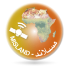

.. MISLAND Documentation documentation master file, created by
   sphinx-quickstart on Tue Nov 16 12:27:59 2021.
   You can adapt this file completely to your liking, but it should at least
   contain the root `toctree` directive.

|Logo| Monitoring Integrated Service for Land Degradation-MISLAND
===================================================================

.. raw:: html

   

       <video style="width: 100%; height: 100%;" controls>
           <source src="https://res.cloudinary.com/dv3id0zrx/video/upload/v1632134558/MISLAND_PROMO_mxnw5c.mp4" type="video/mp4">
           Your browser does not support the video tag.
       </video>
   

   
The Monitoring Integrated System for Land Degradation Monitoring MISLAND has been developed as a 
collaboration between the OSS and LocateIT under the GMES and Africa programme as a Decision Support 
System(DSS) utilizing earth observation data to deliver information, promote awareness and, aid in 
decision making toward realizing Land Degradation Neutrality (LDN) in six OSS North Africa action zone 
countries: Algeria, Egypt, Libya, Tunisia, Morocco, and Mauritania. At the very core, the service 
provided information to monitor SDG indicator 15.3.1 (Proportion of land that is degraded over the 
total land area). In addition, and to improve the understanding and multi-faceted nature of the active 
processes behind land degradation, MISLAND service also provides information on Vegetation loss and 
gain hotspots, Forest change, forest fires and the Mediterranean Desertification and Land Use Model 
(MEDALUS), to assess desertification indicators.

.. toctree::
   :maxdepth: 2
   :caption: Contents:

.. toctree::
   :maxdepth: 2
   :caption: Background:

   Background/LD_indicators

Indices and tables
===================

* :ref:`genindex`
* :ref:`modindex`
* :ref:`search`
